# Documentation

# The ludo game

Project description : [The ludo game - avslutande projekt](https://pgbsnh19.github.io/dataatkomst/project4.html)

Första dagen arbetade vi med att planlägga projekt genom att göra CRC-Kort och User Stories: 

**CRC-kort:** 

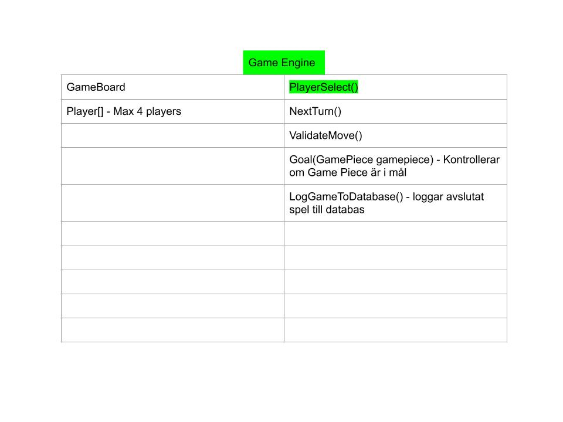
*GameEngine*
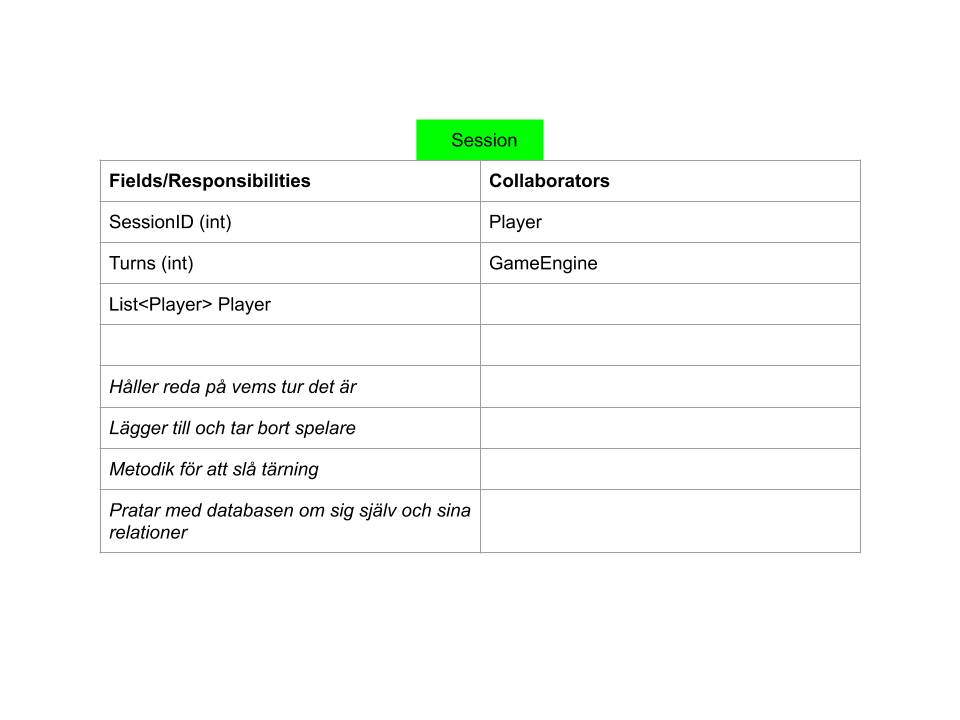
*Session*
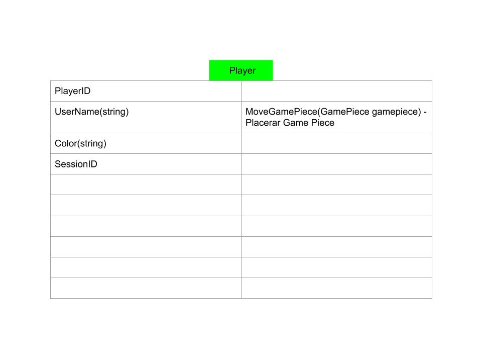
*Player*
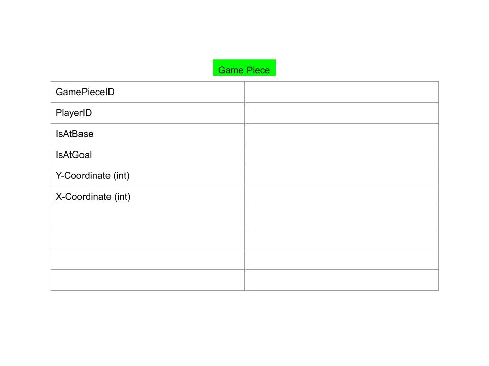
*GamePiece*
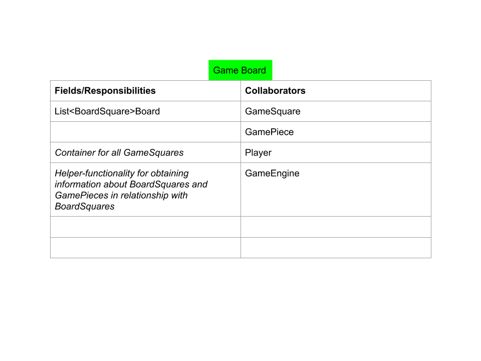
*GameBoard*
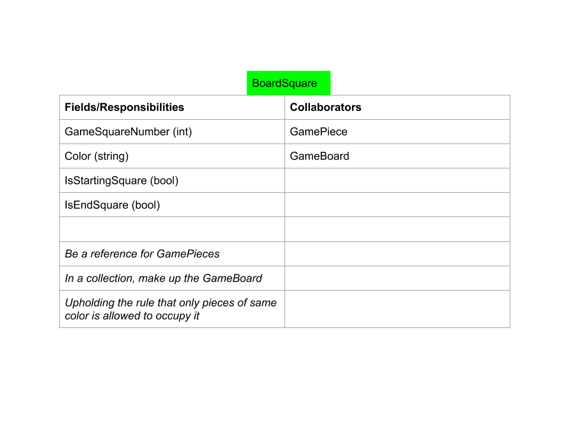
*BoardSquare*

*GameLog*

**User-Stories**
[UserStories](UserStories.docx)
*UserStories*
Vi gjortde user stories, vilket gjorde att vi fick en gemensam bild av funktionaliteten
i projektet men dessa användas inte senare utan vi hade andra sätt att 
hålla reda på funktionaliteten (se milstolpar och GitHub.projekt).

**Relationsdiagram:**

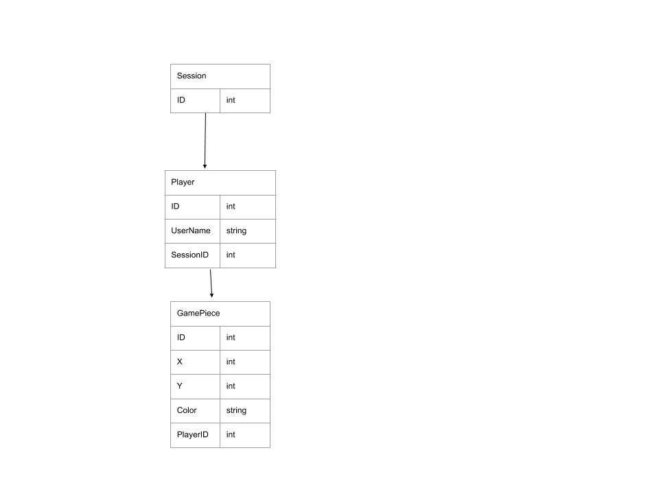
*Databasrelationer*
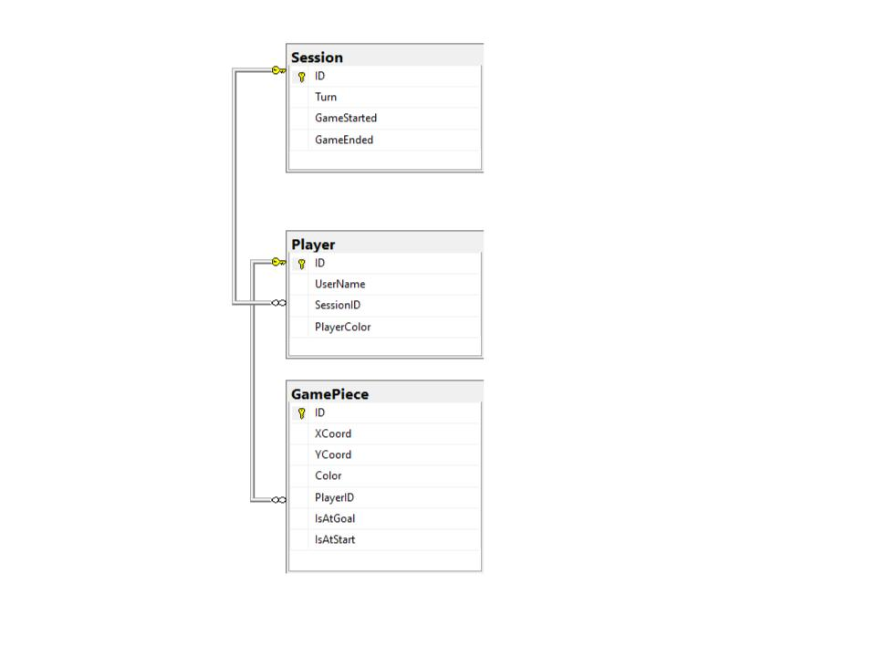
*Databasdiagram*
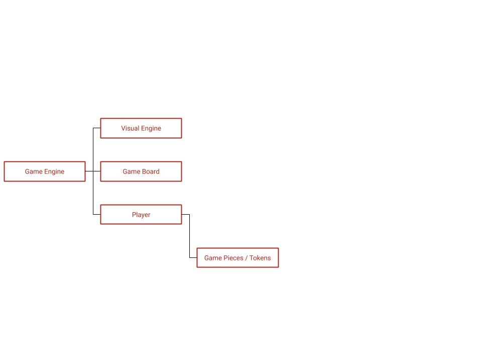
*Objektrelationer - ej fullständig och endast påbörjad*

Vi skapade också levande dokument för regelbestämmelser för projektet:

**Regler:**

[Regler](Regler.docx)

Vi hade även dokument för milstolpar för att kunna få en överblick över hur projektet ska fortskrida härnäst:

**Milstolpar**

[Milstolpar](Milstolpar.docx)

Detta övergavs senare till förmån för att använda GitHubs "Projects".

**Bilder/Skisser**

Lite senare i projektet ritade vi även upp skisser över hur vi skulle visualisera vår spelplan.
Denna process ledde till att vi övergav en tvådimensionell representation 
till förmån för en endimensionell:

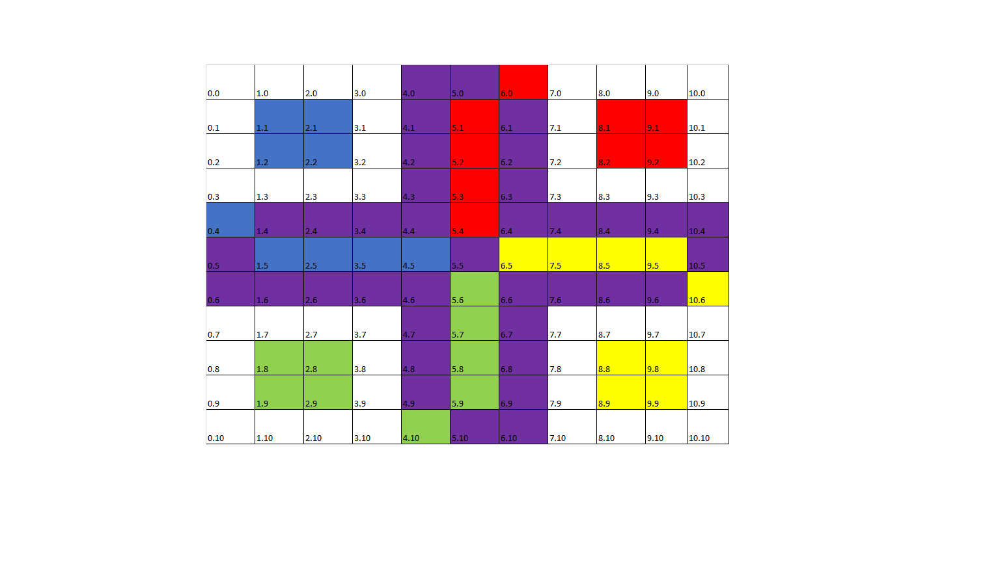
*2D-representation*

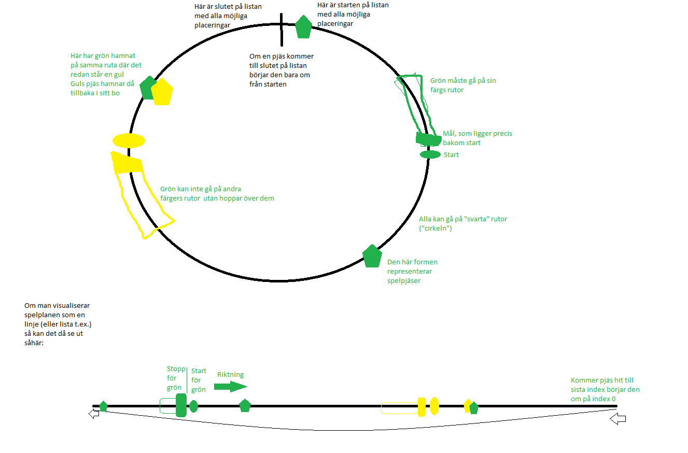
*1D-representation*

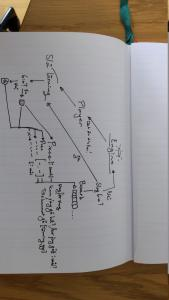

*Flödesschema över Game Loop*

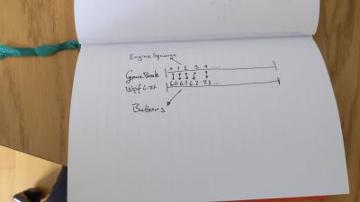

*Översättningstabell 1D - 2D*

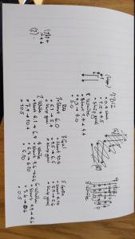

*Bygga bräde med hjälp av loopar*

Löpande under projektet skrev vi dagbok över vad som gjorts den dagen:

**Dagbok:**

[Dagboken](Dagboken.docx)

Vi försökte under projektet få till ett WPF projekt som ett slags frontend-
projekt för att kunna visa spelet. Detta blev för tidskrävande och vi fick överge det projektet.
Hade vi haft mer tid hade vi fått till det men eftersom det inte krävdes för projektet och
vi kände att vi hade viktigare saker att fokusera på rationaliserades detta bort.

Så långt som vi kom i WPF-projektet kan beskådas i en separat branch i projektet för den som är nyfiken.

På slutet föll vi i fällan att vår tidsbrist gjorde att dokumentationen blev något lidande. 
En lärdom är att man som utvecklare återigen hela tiden måste tänka på att planera
sina projekt på ett bra sätt. Det är ganska lätt hänt att man gör dokumentation i början som 
man sedan ogärna återvänder till och redigerar senare i projektet, även om det kanske hade behövts
att man gjorde det. Hade vi underhållit dokumentationen lite bättre under projektets gång generellt 
så hade det nog varit lättare att få in dokumentation även när vi fick tidsbrist.

