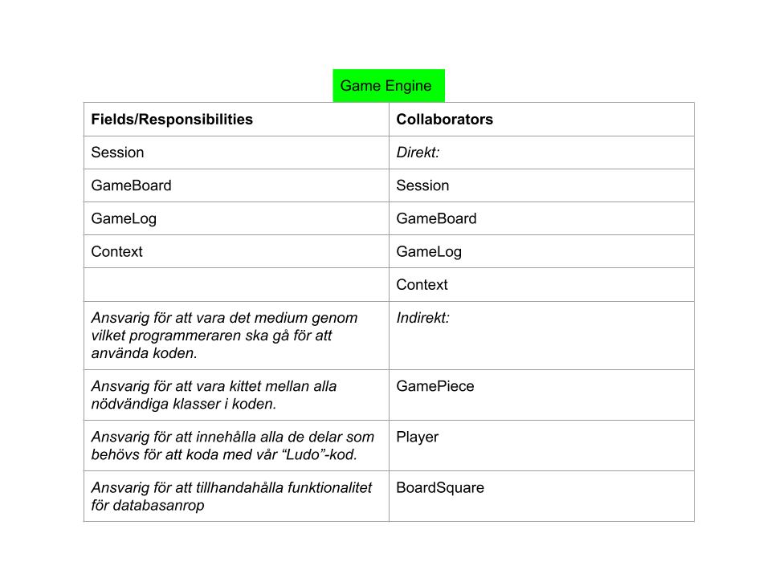
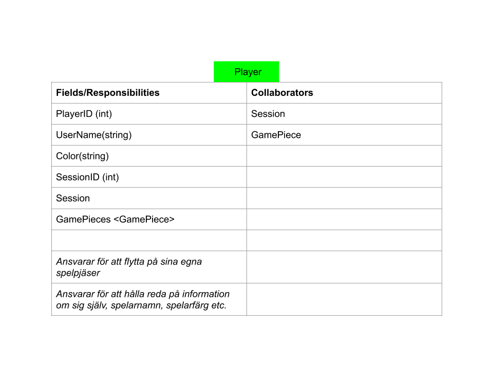
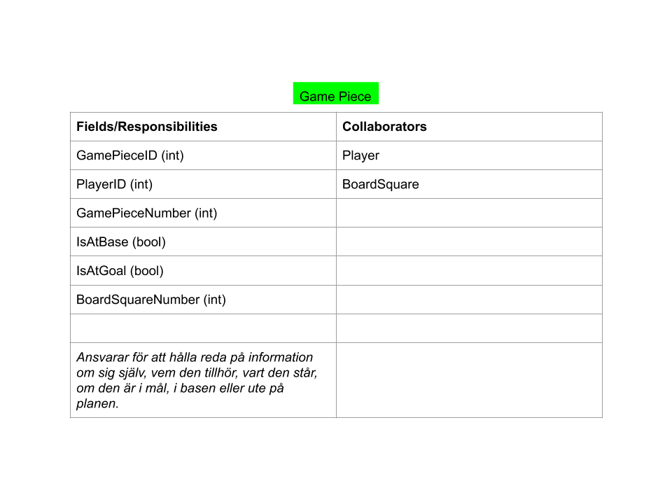
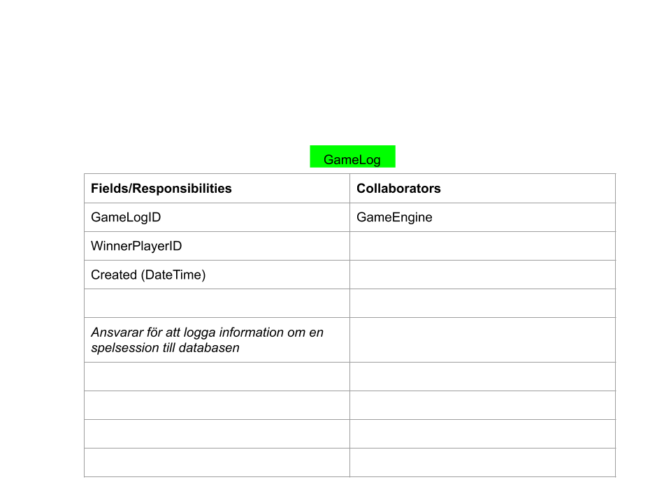

# Documentation

# The ludo game

Project description : [The ludo game - avslutande projekt](https://pgbsnh19.github.io/dataatkomst/project4.html)

Första dagen arbetade vi med att planlägga projekt genom att göra: 

**CRC-kort:** 

**Relationsdiagram:**

**User-stories:**

[UserStories](UserStories.docx)

Vi skapade också levande dokument för regelbestämmelser för projektet:

**Regler:**

[Regler](Regler.docx)

Vi hade även dokument för milstolpar för att kunna få en överblick över hur projektet ska fortskrida härnäst:

**Milstolpar**

[Milstolpar](Milstolpar.docx)

Detta övergavs senare till förmån för att använda GitHubs "Projects".

Lite senare i projektet ritade vi även upp skisser över hur vi skulle visualisera vår spelplan.
Denna process ledde till att vi övergav en tvådimensionell representation 
till förmån för en endimensionell:

Löpande under projektet skrev vi dagbok över vad som gjorts den dagen:

**Dagbok:**

[Dagboken](Dagboken.docx)

Vi försökte under projektet få till ett WPF dokument som ett slags frontend-
projekt för att kunna visa spelet. Detta blev för tidskrävande och vi fick överge det projektet.
Hade vi haft mer tid hade vi fått till det men eftersom det inte krävdes för projektet och
vi kände att vi hade viktigare saker att fokusera på rationaliserades detta bort.

Så långt som vi kom i WPF-projektet kan beskådes i en separat branch i projektet för den som är nyfiken.

 

